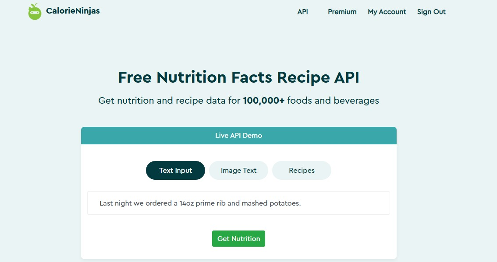

  

# Apresentação
* Aplicação desenvolvida como parte do Projeto Final do curso de Análise e Desenvolvimento de Sistemas no ano de 2025/1.

### Autoria:
Henry Matheus Adam - RA 1934934

[LinkedIn](https://www.linkedin.com/in/henry-adam/)

### Professor orientador:
Professor Doutor Roberto Zanoni

# API
Este projeto realiza consultas à API CalorieNinjas com o intuito de fornecer informações nutricionais aos usuários.

[CalorieNinjas](https://calorieninjas.com/)

